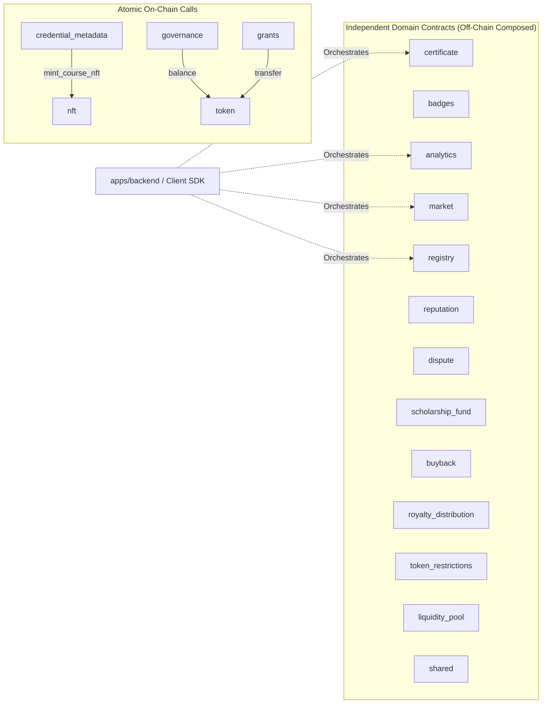

# ADR-0001: Soroban Contract Module Boundaries and Cross-Contract Call Conventions

**Status:** Accepted

**Date:** 2026-08-25

**Author(s):** Brain-Storm Architecture & Smart Contracts Team

---

## Context

The Brain-Storm smart contract system on Stellar/Soroban is organized into 20 independent Rust crates under `contracts/`:

1. `analytics` — Student course progress tracking, milestone achievements, and platform metrics
2. `badges` — Soulbound and transferable skill badge issuance and verification
3. `buyback` — Automated BST token buyback and burn/treasury mechanism using platform fees
4. `certificate` — Soulbound, verifiable on-chain course completion certificates
5. `credential_metadata` — Extended on-chain and IPFS/Arweave metadata registry for credentials
6. `dispute` — Decentralized dispute resolution and escrow arbitration
7. `governance` — Community proposal management, voting power evaluation, and execution
8. `grants` — Educational grant proposal lifecycle, milestone tracking, and fund disbursement
9. `integration` — Multi-contract integration test harness and end-to-end workflow runner (non-production)
10. `liquidity_pool` — Constant-product Automated Market Maker (AMM) pool for BST liquidity
11. `market` — Course & digital asset marketplace with escrow settlement
12. `nft` — Non-fungible token standard implementation for collectible and educational credentials
13. `registry` — Registry of verified course creators, educational institutions, and accredited verifiers
14. `reputation` — Non-transferable on-chain reputation scoring for students, reviewers, and educators
15. `royalty_distribution` — Automated secondary-sale royalty splitting and creator disbursements
16. `scholarship_fund` — Scholarship application management, donor pools, and disbursements
17. `shared` — Shared RBAC, access control helpers, reentrancy guards, emergency pause, and unified `SharedError` enum
18. `token` — Brain-Storm Token (BST) SEP-41 standard token with staking and airdrops
19. `token_restrictions` — Regulatory compliance checks, transfer limits, and address blacklisting
20. `types` — Cross-contract shared data types and interface serialization bindings

Historically, smart contract systems on other ecosystems often consolidated functionality into large monolithic contracts or complex proxy diamonds. However, Soroban WASM size limits, independent upgrade cycles, blast radius containment, and gas metering necessitate a clear boundary definition and invocation protocol.

---

## Decision

We establish a **Contract-per-Domain Architecture** where each business domain is encapsulated in an independent, individually-compiled Soroban WASM contract crate. 

Cross-domain interactions must strictly adhere to the following rules:

1. **Off-Chain Orchestration Preferred:** Cross-domain operations should generally be orchestrated off-chain by `apps/backend` (or client applications) across sequential transactions, rather than relying on nested on-chain cross-contract invocations.
2. **Strictly Permitted On-Chain Invocations:** On-chain cross-contract calls are permitted only where atomic state guarantees are strictly required (e.g. fund transfers, atomic NFT minting).
3. **No Direct Crate Coupling:** Production contracts must not declare compile-time path dependencies on other production contract crates. Instead, on-chain calls use `env.invoke_contract()` or locally-declared `#[contractclient]` interfaces.
4. **Unified Error & Pattern Reuse:** Contracts leverage standardized error codes and common patterns defined in `contracts/shared`.
5. **Integration Harness Isolation:** `contracts/integration` serves exclusively as a multi-contract test harness and scenario runner, importing production crates as `[dev-dependencies]`.

---

## Permitted Cross-Contract Call Graph

The verified on-chain call matrix across all production contracts is defined as follows:

| Caller Contract | Callee Contract | Invocation Method | Target Function | Purpose |
|---|---|---|---|---|
| `contracts/credential_metadata` | `contracts/nft` | Local client stub (`LinkageClient`) | `mint_course_nft` | Atomically mints an associated NFT whenever a credential is issued with NFT linkage |
| `contracts/governance` | `contracts/token` | Dynamic invocation (`env.invoke_contract`) | `balance` | Queries a voter's BST token balance at the proposal snapshot ledger to weight votes |
| `contracts/grants` | `contracts/token` | Dynamic invocation (`env.invoke_contract`) | `transfer` | Transfers BST funds from the grant contract vault to an approved recipient upon milestone verification |

---

## Shared Error & Event Conventions (`contracts/shared`)

### 1. Unified Error Codes (`SharedError`)
All contracts use the standardized `SharedError` enum (`contracts/shared/src/errors.rs`) to ensure consistent error handling across the monorepo:

- **1 – 10:** Initialization & State (`NotInitialized = 1`, `AlreadyInitialized = 2`, `InvalidState = 3`)
- **11 – 20:** Authorization & Access Control (`Unauthorized = 11`, `AdminOnly = 12`, `CuratorOnly = 13`, `InvalidRole = 14`)
- **21 – 40:** Validation Errors (`InvalidAmount = 21`, `InvalidPercentage = 22`, `InvalidTimestamp = 23`, `EmptyString = 24`, `InvalidCredential = 25`, `InvalidMetadata = 26`)
- **41 – 60:** State & Data (`NotFound = 41`, `AlreadyExists = 42`, `AlreadyPaused = 43`, `NotPaused = 44`)
- **61 – 70:** Contract State & Safety (`ContractPaused = 61`, `ReentrantCall = 62`, `OperationBlocked = 63`)
- **71 – 90:** Proposals & Governance (`ProposalExpired = 71`, `ProposalAlreadyExecuted = 72`, `InsufficientApprovals = 73`, `ProposalNotFound = 74`)
- **91 – 110:** Limits & Restrictions (`LimitExceeded = 91`, `BlacklisterError = 92`, `WhitelistError = 93`, `TransferDenied = 94`, `ApprovalRequired = 95`)
- **111 – 130:** Credential & Metadata (`CredentialExpired = 111`, `CredentialNotValid = 112`, `CredentialCannotRenew = 113`, `HashMismatch = 114`)
- **131 – 150:** NFT & Linkage (`NFTContractNotSet = 131`, `NFTMintFailed = 132`, `LinkageNotFound = 133`)
- **200:** General Execution Failure (`OperationFailed = 200`)

### 2. Standardized Event Topics & Payloads
Events emitted across all contracts must conform to a two-topic structure:
- **Topic 0:** Domain Symbol (e.g. `symbol_short!("cert")`, `symbol_short!("token")`, `symbol_short!("gov")`)
- **Topic 1:** Action Symbol (e.g. `symbol_short!("mint")`, `symbol_short!("burn")`, `symbol_short!("transfer")`, `symbol_short!("paused")`)
- **Data Payload:** Tuple containing the primary entity identifier, actor address, and relevant parameters: `(caller, id, amount_or_details)`

---

## Rules for Adding a New Contract Crate

When a new business domain requires on-chain logic, developers must adhere to the following checklist:

1. **Domain Justification:** Verify that the logic cannot be achieved through existing domain contracts or off-chain database logic.
2. **Directory & Manifest Setup:**
   - Create directory `contracts/<crate_name>/`
   - Include standard `Cargo.toml` specifying `crate-type = ["cdylib"]` and `[dependencies] soroban-sdk = { workspace = true }`.
   - Register the crate in root `Cargo.toml` under `[workspace] members`.
3. **No Direct Production Dependencies:** Do not add `path = "../other_contract"` in production dependencies. If cross-contract invocation is required, define a minimal `#[contractclient]` trait or use `env.invoke_contract()`.
4. **Implement Standard Lifecycles:**
   - Implement `initialize(admin: Address)` with single-execution enforcement (`SharedError::AlreadyInitialized`).
   - Implement `get_admin()` and `set_admin(new_admin: Address)` with authorization checks via `brain_storm_shared::access::require_admin`.
5. **Use Standard Error Codes:** Use `SharedError` variants from `brain_storm_shared::errors` rather than arbitrary panic strings or ad-hoc error codes.
6. **Add Integration Tests:** Add comprehensive multi-contract scenario tests to `contracts/integration/src/tests.rs`.
7. **Document in Interface Guide:** Update `docs/contract-interfaces.md` and `docs/contracts/errors.md`.

---

## Rationale & Alternatives Considered

| Alternative | Evaluation | Why Rejected |
|---|---|---|
| **Monolithic Contract** | Single WASM binary containing all platform logic. | Exceeds Soroban WASM size limits; any bug or upgrade requires redeploying the entire platform; high blast radius. |
| **Direct Crate Path Dependencies** | Production crates importing each other directly via Cargo. | Causes code duplication in WASM binaries, bloats binary size, and breaks Soroban resolver isolation. |
| **All Cross-Contract Calls On-Chain** | Extensive synchronous cross-contract calls for all operations. | Expensive in transaction gas, brittle to dependency failures, and introduces reentrancy risks. |

---

## Consequences

### Positive
- **Compact Bytecode:** Each contract compiles to an optimized WASM binary well within Soroban limits.
- **Isolated Upgrades:** Upgrading one domain contract (e.g. `analytics`) does not affect unaffected contracts (e.g. `token`).
- **Clear Security Model:** Bounded attack surface with explicit, auditable cross-contract edges.
- **Predictable Error Handling:** Unified error codes decoded automatically across SDK and backend.

### Negative
- **Orchestration Overhead:** Multi-step workflows requiring multiple domain actions must be sequenced by backend transactions.

---

## References

- [ADR-006: Contract-Per-Domain Architecture](./ADR-006-contract-per-domain-architecture.md)
- [ADR-007: Shared Crate for Common Contract Code](./ADR-007-shared-crate-for-common-code.md)
- [ADR-008: Registry and Integration Separation](./ADR-008-registry-integration-separation.md)
- [ADR-009: Credential and NFT Decomposition](./ADR-009-credential-nft-decomposition.md)
- [Contract Interface Reference](../contract-interfaces.md)
- [Contract Errors Reference](../contracts/errors.md)
