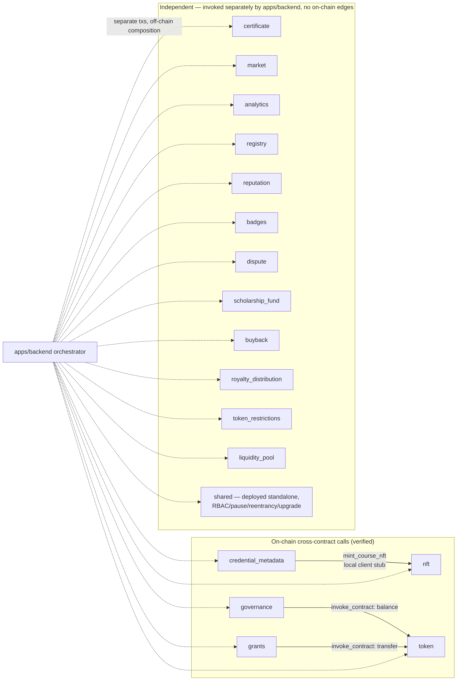

# ADR-006: Contract-Per-Domain Architecture (vs. a Monolithic Contract)

**Status:** Accepted

**Date:** 2026-07-25

**Author(s):** Brain-Storm maintainers

---

## Context

`contracts/` holds 18 crates registered in the Cargo workspace (`Cargo.toml`) plus a 19th (`contracts/royalty_distribution`) that has its own manifest but is **not currently listed** in the workspace `members` array — a discrepancy noted here rather than silently "fixed," since correcting it is a build-config change outside the scope of this documentation effort:

`analytics`, `badges`, `buyback`, `certificate`, `credential_metadata`, `dispute`, `governance`, `grants`, `liquidity_pool`, `market`, `nft`, `registry`, `reputation`, `royalty_distribution`, `scholarship_fund`, `shared`, `token`, `token_restrictions` — plus `integration`, which is a test-only crate (see [ADR-008](./ADR-008-registry-integration-separation.md)) rather than a deployable contract.

None of these crates declare a compile-time path dependency on any other **production** contract crate (verified by grepping every `contracts/*/Cargo.toml` for `path = `). The only crate with cross-contract path dependencies is `contracts/integration`, and those are `[dev-dependencies]` used purely for test harness deployment. This means the 18 deployable contracts are, by construction, independently compiled, independently sized, and independently upgradable WASM modules — there is no shared runtime or shared address space between them.

New contributors and auditors have had to reverse-engineer why the platform is split this way instead of, say, one large "Platform" contract with internal modules. This ADR records that rationale.

## Decision

We deploy one Soroban contract per business domain (token economics, credentials, marketplace, governance, etc.) rather than a single monolithic contract, and we accept that most cross-domain composition happens **off-chain**, orchestrated by `apps/backend`, rather than through on-chain cross-contract calls.

### Verified on-chain call graph

Grepping every contract for `invoke_contract` and the `#[contractclient]` macro (the two ways a Soroban contract calls another contract) turns up exactly **three** on-chain edges across all 18 production contracts:

| Caller                                | Callee                 | Mechanism                                                                                                                                    | Call                                                     | Why                                                                                                                                                 |
| ------------------------------------- | ---------------------- | -------------------------------------------------------------------------------------------------------------------------------------------- | -------------------------------------------------------- | --------------------------------------------------------------------------------------------------------------------------------------------------- |
| `credential_metadata::issue_with_nft` | `nft::mint_course_nft` | Locally-declared `#[contractclient]` stub (`contracts/credential_metadata/src/linkage.rs`) — **not** a crate dependency on `brain-storm-nft` | Mint a linked NFT atomically when a credential is issued | Issuing the credential record and minting its NFT must succeed or fail together (issue #635); a stub avoids coupling the two crates at compile time |
| `governance`                          | `token::balance`       | `env.invoke_contract` (dynamic, untyped)                                                                                                     | Read a voter's BST balance to weight a vote              | Voting power is derived from live token balance, not a duplicated ledger inside governance                                                          |
| `grants`                              | `token::transfer`      | `env.invoke_contract` (dynamic, untyped)                                                                                                     | Disburse milestone funds to a grant applicant            | Fund release must move real BST, which only the token contract can authorize                                                                        |

Everything outside those three edges — e.g. a marketplace purchase that touches `market` (escrow) and separately `nft` (ownership transfer) and separately `royalty_distribution` (creator payout) — is composed by `apps/backend` issuing separate Stellar transactions, not by one contract calling another. See [docs/contract-interfaces.md § Cross-Contract Call Conventions](../contract-interfaces.md#cross-contract-call-conventions) for how the backend sequences those flows and what happens on partial failure.

## Rationale

**Why not one monolithic contract?**

- **WASM size and gas.** Soroban meters and caps contract code size and per-invocation CPU/memory instructions. A single contract holding token economics, marketplace escrow, governance voting, dispute resolution, and 15 other domains would be large, slow to instantiate, and would make every invocation pay the cost of code it doesn't use.
- **Blast radius of upgrades.** Each contract upgrades independently via `shared::schedule_upgrade` / `execute_upgrade` (timelocked) or, for `governance`-gated contracts, `propose_upgrade` → `vote_upgrade` → `approve_upgrade` → `execute_upgrade`. A bug fix to the dispute-resolution logic should not require re-auditing and re-deploying the token contract.
- **Audit surface.** Security review of a 300–600 line single-domain contract (the actual size range of `contracts/*/src/lib.rs` in this codebase) is tractable; reviewing a merged multi-thousand-line contract is not, and a vulnerability in one domain (e.g. `liquidity_pool` swap math) can't corrupt storage in an unrelated domain (e.g. `certificate` records) because they are different contract instances with separate storage.
- **Independent admin keys.** Each contract has its own `Admin` storage entry and its own `require_auth()` gate, so compromising one contract's admin key does not automatically compromise every domain.

**Why accept off-chain composition instead of building more on-chain call chains like the three that exist?**

- Each additional on-chain cross-contract call adds gas cost and a hard compile-time or dynamic-invocation dependency between two independently-upgradable contracts (if contract A hardcodes contract B's address and interface, upgrading B's interface can break A). The three edges that exist were added because atomicity was a hard requirement (credential+NFT must not exist in a partial state; a vote must read _current_ balance; a fund release must actually move tokens or not happen at all). Everywhere else, `apps/backend` already has to persist off-chain state (PostgreSQL rows for users, courses, enrollments) alongside on-chain effects, so it was already the natural place to sequence multi-contract flows and handle partial-failure/retry logic.

**Alternatives considered**

1. **Single monolithic "Platform" contract.** Rejected — WASM size/gas limits, audit surface, and upgrade blast radius as above.
2. **A handful of larger contracts grouped by rough theme (e.g. one "Credentials" contract covering certificate + credential_metadata + nft + badges).** Rejected for the credential domain specifically — see [ADR-009](./ADR-009-credential-nft-decomposition.md) for why those three stayed separate.
3. **More on-chain cross-contract calls to reduce backend orchestration.** Rejected as a default — reserved for cases (like the three above) where atomicity is a correctness requirement, not a convenience.

## Consequences

### Positive

- Each contract can be independently upgraded, paused, and audited.
- A bug or exploit in one domain's storage cannot directly corrupt another domain's storage.
- New domains (e.g. `dispute`, added later per its own `#659` issue reference) can be added as new crates without touching existing contracts.

### Negative

- Multi-contract business flows (e.g. an NFT marketplace purchase touching `market`, `nft`, and `royalty_distribution`) are **not atomic on-chain** — `apps/backend` must sequence separate transactions and handle partial failure (e.g. escrow funded but royalty distribution transaction fails) with its own retry/reconciliation logic. This is not currently documented in one place; contributors should read the worked examples in [docs/contract-interfaces.md](../contract-interfaces.md) before adding a new multi-contract flow.
- `contracts/royalty_distribution` exists as a crate but is absent from the root `Cargo.toml` workspace `members` list, so `cargo build`/`cargo test` at the workspace root silently skips it. Anyone touching that contract must build it explicitly: `cargo build --manifest-path contracts/royalty_distribution/Cargo.toml --target wasm32-unknown-unknown`.

### Neutral

- Contracts do not share compiled code. Common patterns (pause, reentrancy guard, admin check) are either copied per-contract or, for RBAC specifically, available from the separately-deployed `shared` contract — see [ADR-007](./ADR-007-shared-crate-for-common-code.md).

## Implementation Notes

- When adding a new contract, default to a new crate under `contracts/<name>/` with its own `Cargo.toml`, and add it to the root workspace `members` list (unlike `royalty_distribution`, which was missed).
- Only add an on-chain cross-contract call (`invoke_contract` or a local `#[contractclient]` stub, per [ADR-008](./ADR-008-registry-integration-separation.md)'s pattern) when atomicity across two contracts is a correctness requirement — not for convenience. Prefer backend orchestration otherwise.
- Never add a compile-time path dependency from one production contract onto another; that pattern is reserved for the `contracts/integration` test-only crate.

## References

- [Root `Cargo.toml`](../../Cargo.toml)
- [contracts/credential_metadata/src/linkage.rs](../../contracts/credential_metadata/src/linkage.rs)
- [contracts/governance/src/lib.rs](../../contracts/governance/src/lib.rs)
- [contracts/grants/src/lib.rs](../../contracts/grants/src/lib.rs)
- [docs/contract-interfaces.md](../contract-interfaces.md)
- [ADR-007: Shared Crate for Common Code](./ADR-007-shared-crate-for-common-code.md)
- [ADR-008: Registry vs. Integration Crate Separation](./ADR-008-registry-integration-separation.md)
- [ADR-009: Credential/NFT Contract Decomposition](./ADR-009-credential-nft-decomposition.md)
- [Issue #762](https://github.com/BrainTease/Brain-Storm/issues/762)

## Revision History

| Date       | Author                  | Change                                                                                             |
| ---------- | ----------------------- | -------------------------------------------------------------------------------------------------- |
| 2026-07-25 | Brain-Storm maintainers | Initial proposal, derived from git history and static analysis of `contracts/*/src` for issue #762 |
