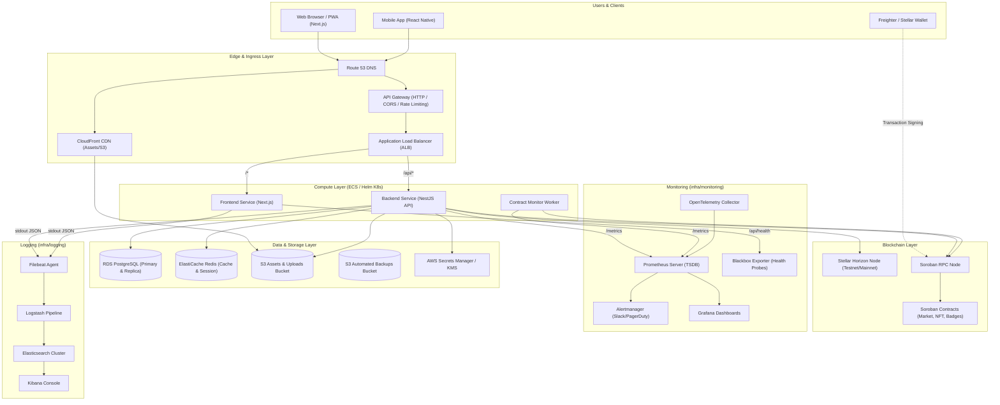

# Infrastructure & Deployment Topology Overview

This document describes the end-to-end infrastructure topology, orchestration, monitoring, logging, and deployment workflows for the **Brain-Storm** platform.

---

## 1. System Architecture & Service Topology

The Brain-Storm platform spans multiple layers:
1. **Edge & Ingress**: Route 53, CloudFront CDN, API Gateway / Application Load Balancer (ALB).
2. **Compute / Orchestration**: Containerized Next.js Frontend and NestJS Backend deployed on AWS ECS / Kubernetes via Helm.
3. **Data Stores**: AWS RDS PostgreSQL (Multi-AZ in production) and AWS ElastiCache Redis (cluster mode).
4. **Blockchain Layer**: Stellar Horizon RPC and Soroban Smart Contracts (Rust WASM).
5. **Observability**: Prometheus, Alertmanager, Grafana, OpenTelemetry, and Blackbox Exporter.
6. **Centralized Logging**: Filebeat, Logstash, Elasticsearch, and Kibana (ELK stack).
7. **Infrastructure as Code**: Terraform modules managing AWS resource lifecycles.

### Service Topology Diagram



---

## 2. Infrastructure Directory Layout & Modules

The repository's infrastructure configuration resides under `infra/`:

```
infra/
├── terraform/                # AWS Infrastructure as Code (Terraform)
│   ├── main.tf               # Root module composition
│   ├── variables.tf          # Global input variables
│   ├── outputs.tf            # Global outputs
│   ├── terraform.tfvars.example
│   ├── environments/         # Environment specific configurations (staging, prod)
│   └── modules/              # Reusable Terraform modules
│       ├── vpc/              # Multi-AZ VPC, subnets, NAT gateways, flow logs
│       ├── ecr/              # Container registries with lifecycle policies
│       ├── rds/              # PostgreSQL RDS instance / cluster with encryption
│       ├── elasticache/      # Redis replication group and subnet groups
│       ├── ecs/              # ECS cluster, task definitions, services
│       ├── alb/              # Application Load Balancer, listeners, target groups
│       ├── autoscaling/      # Target-tracking auto-scaling policies for ECS
│       ├── api-gateway/      # HTTP API Gateway with CORS, JWT authorizer, routes
│       ├── oidc/             # GitHub Actions OIDC provider and IAM role
│       ├── secrets/          # AWS Secrets Manager entries with auto-rotation
│       ├── storage/          # S3 buckets for media assets and database backups
│       ├── cost-analysis/    # AWS Budgets and cost threshold alert configuration
│       └── savings-plans/    # Reserved instances and Savings Plans commitments
├── helm/                     # Kubernetes Deployment Manifests (Helm)
│   └── brain-storm/          # Umbrella chart for backend, frontend & workers
├── monitoring/               # Metrics collection, alerting & dashboards
│   ├── prometheus/           # Prometheus server config and scrape targets
│   ├── alertmanager/         # Alert notification routing & receivers
│   ├── grafana/              # Pre-provisioned datasources and dashboards
│   ├── otel-collector/       # OpenTelemetry collector configuration
│   ├── blackbox/             # Synthetic endpoint health checking
│   └── contracts/            # Soroban contract performance alerting rules
└── logging/                  # Centralized logging pipeline
    ├── filebeat/             # Container log shippers
    ├── logstash/             # Log filtering and grok pipeline
    ├── elasticsearch/        # Log indexing and lifecycle management
    └── kibana/               # Pre-configured index patterns & visualizations
```

---

## 3. High-Level Terraform Module Inputs & Outputs

| Module | Purpose | Key Inputs | Key Outputs |
| :--- | :--- | :--- | :--- |
| **`vpc`** | Core networking | `vpc_cidr`, `environment`, `enable_flow_logs` | `vpc_id`, `vpc_cidr`, `public_subnet_ids`, `private_subnet_ids` |
| **`ecr`** | Container image storage | `environment`, `image_retention_count`, `github_actions_role_arn` | `backend_repository_url`, `frontend_repository_url` |
| **`rds`** | Relational database (PostgreSQL) | `vpc_id`, `private_subnet_ids`, `db_instance_class`, `multi_az`, `db_name`, `db_username` | `db_endpoint`, `db_instance_id`, `db_resource_id` |
| **`elasticache`** | In-memory cache & sessions (Redis) | `vpc_id`, `private_subnet_ids`, `node_type`, `environment` | `redis_endpoint`, `redis_port` |
| **`ecs`** | Application container execution | `vpc_id`, `private_subnet_ids`, `backend_image`, `frontend_image`, `db_host`, `redis_host`, `backend_secrets` | `cluster_name`, `backend_service_name`, `frontend_service_name`, `backend_target_group_arn` |
| **`alb`** | Ingress traffic distribution | `vpc_id`, `public_subnet_ids`, `backend_target_group_arn`, `frontend_target_group_arn`, `https_certificate_arn` | `alb_dns_name`, `alb_zone_id`, `http_listener_arn`, `https_listener_arn` |
| **`api_gateway`** | API Gateway & Route protection | `vpc_id`, `private_subnet_ids`, `alb_listener_arn`, `cors_allow_origins` | `api_gateway_endpoint`, `api_gateway_id` |
| **`oidc`** | Keyless CI/CD authentication | `github_org`, `github_repo` | `role_arn` |
| **`secrets`** | Secure credential management | `db_password`, `jwt_secret`, `stellar_secret_key`, `enable_rotation` | `db_password_secret_arn`, `jwt_secret_arn`, `stellar_key_secret_arn` |
| **`storage`** | S3 Object storage | `cors_allowed_origins`, `backup_retention_days` | `assets_bucket_name`, `backups_bucket_name`, `assets_bucket_arn` |
| **`autoscaling`**| ECS dynamic scaling | `cluster_name`, `backend_service_name`, `backend_min_capacity`, `backend_max_capacity` | `backend_scale_target_arn` |
| **`cost_analysis`**| Cost governance & budgeting | `monthly_budget_limit`, `cost_alert_email` | `budget_id` |

---

## 4. Helm Deployment & Kubernetes Topology

The `infra/helm/brain-storm` chart coordinates container orchestration:
- **Backend Deployment**: Configured with Horizontal Pod Autoscaler (HPA) targeting 70% CPU and 80% memory utilization. Liveness probe targets `/v1/health/liveness` and readiness probe targets `/v1/health/readiness`.
- **Frontend Deployment**: Configured with rolling updates, Next.js cache volume mounts, and health checks on `/api/health`.
- **ConfigMaps & Secrets**: Injected from Kubernetes Secrets populated via AWS Secrets Manager synchronization.
- **Service Mesh / Ingress**: Standard Ingress resource directing traffic based on path rules (`/v1/*` to backend service, `/*` to frontend service).

---

## 5. Monitoring & Centralized Logging Architecture

### Observability Pipeline (`infra/monitoring`)
1. **Scraping**: Prometheus polls metrics every 10s from the Backend (`/metrics`), synthetic health from Blackbox Exporter (`/probe`), and contract stats from Contract Monitor (`/metrics`).
2. **Alert Rules**: Evaluated every 15s across:
   - `application-rules.yml`: High error rates (5xx > 1%), latency degradation (p95 > 500ms), and worker crash-loops.
   - `contracts/alerting-rules.yml`: Soroban transaction submission failures, RPC throttles, and contract error returns.
   - `backup-rules.yml`: Stale database backup snapshots (> 24h).
3. **Alertmanager**: Deduplicates and routes alerts to configured Slack webhooks and on-call escalation channels.
4. **Dashboards**: Grafana auto-provisions dashboards for NestJS API Golden Signals, JVM/Node memory, PostgreSQL connections, and Soroban contract invocation rates.

### Logging Pipeline (`infra/logging`)
1. **Ingestion**: Filebeat reads JSON structured log streams from container stdout.
2. **Parsing & Enrichment**: Logstash applies timestamp normalization, geo-IP parsing, level mapping (`info`, `warn`, `error`), and strips sensitive headers.
3. **Storage**: Elasticsearch stores indexed logs in daily indices with ILM (Index Lifecycle Management) retiring logs after 30 days.
4. **Analysis**: Kibana provides search interfaces, error heatmaps, and transaction trace tracking.

---

## 6. Manual Steps Not Yet Automated

While most infrastructure provisioning is automated via Terraform and CI/CD pipelines, the following manual steps remain required during initial environment bootstrap or rotation:

1. **DNS Delegation & Domain Verification**:
   - Register domain names in Route 53 or delegate NS records from external registrar.
   - Create DNS validation CNAME records for AWS Certificate Manager (ACM) SSL/TLS certificates.
2. **Initial GitHub Actions OIDC Bootstrapping**:
   - Run `infra/terraform/bootstrap` manually to provision the S3 remote state bucket, DynamoDB lock table, and GitHub Actions OIDC role before running CI/CD.
   - Manually populate repository secrets (`AWS_ROLE_ARN`, `AWS_REGION`) in GitHub repository settings.
3. **Soroban Contract Deployment & Keypair Funding**:
   - Deploy compiled WASM contracts (`contracts/market`, `contracts/nft`, `contracts/badges`, etc.) to Stellar Testnet/Mainnet using the Stellar CLI.
   - Fund the deployer and admin Stellar accounts with native XLM via Friendbot (testnet) or custodian transfer (mainnet).
   - Initialize contract storage with admin public keys and configure initial protocol fees.
4. **Master Secrets & KMS Provisioning**:
   - Generate initial KMS keys and populate root database passwords in AWS Secrets Manager prior to launching the database module.
5. **Grafana & Alert Notification Channels**:
   - Secure the initial Grafana administrator credentials (`GF_SECURITY_ADMIN_PASSWORD`).
   - Configure external third-party webhook URLs in `infra/monitoring/alertmanager/alertmanager.yml` (Slack webhook URLs, PagerDuty integration keys) via encrypted vault parameters.
